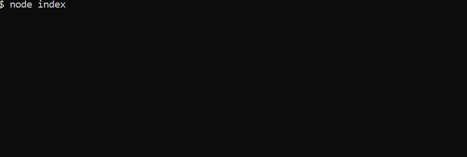

# node-word-guess
A command line word guess game. Hint: the theme of the game is travel.

## Instructions
1. Run npm install 
3. On the command line, enter the command "node index"
4. You will be presented with a hidden word. Enter your guess at a letter that might be in the word. If the letter is in the word, it will appear in position in the hidden word. You have 10 tries to guess the word. If you run out of tries, the answer will appear and then a new hidden word will appear. If you guess the word, a new hidden word will appear. 
4. Type Control + C to exit the game.  
  

  
    
## Technology
* This app was a fun exercise in creating and exporting javascript objects. There is a Letter object that knows how to present itself as a letter or a _. The Word object uses the Letter Object to create the hidden word.
* This app uses the inquirer node package for user prompts.
